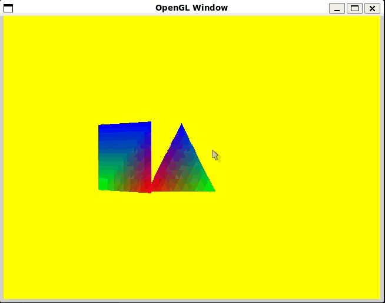

# Modern OpenGL Exploration

This project exists purely out of **personal interest**. I wanted to better understand how C++ can take advantage of the GPU.

I am not a graphics expert, and this is **not intended to be a game engine**. Most famous 3D games are implemented with C++, 
and I’ve always been curious about the theory behind this. This repository contains experiments around those concepts.

- CPU ↔ GPU interaction
- Modern OpenGL concepts (VAO, VBO, shaders)
- Graphics-oriented architecture in C++
- Mathematical foundations for 3D rendering
  
---

## Code

### `0_gl_setup`

Minimal OpenGL validation project.

- SDL window and OpenGL context creation
- Function loading via **glad**
- GPU and OpenGL capability queries

Purpose: environment verification and baseline setup.

---

### `1_draw_triangle`

Exploration of the modern OpenGL rendering pipeline.

- VAO and VBO management
- Shader compilation and linking
- Multiple vertex data layouts:
  - Single VBO (positions only)
  - Interleaved VBO (position + color)
  - Multiple VBOs (separate buffers)
- Rendering:
  - Triangle
  - Quad (two triangles)

#### Options
```bash
./prog        # triangle (default)
./prog -q     # quad
```

### Building
```bash
make vbo-single       # single VBO (positions only)
make vbo-interleaved  # interleaved position + color
make vbo-multiple     # multiple VBOs (separate buffers)
```
---

### Architecture Overview

- Application - SDL initialization and application lifecycle and event loop
- GLWindow - SDL window creation and OpenGL context management
- Renderer - OpenGL state setup and draw calls
- GPUObject - Owns VAO, VBO(s), shader program and uploads geometry data to the GPU
- GeometryData - CPU-side vertex definitions (triangle / quad) (Used to experiment with different VBO layouts)

### NOTE: 
The classes and responsibilities do not follow common OpenGL design conventions.
I chose to focus on Buffer Objects rather than established abstractions.
Names such as GPUObject are intended to make buffer ownership and usage explicit.

In 3_move_objects, more conventional OpenGL responsibilities are used
(e.g. Mesh, Material, Renderable, etc.).

---
### `2_glm_notes`

Isolated experiments focused on GLM and graphics-related mathematics.
No rendering code.

- Vector operations:
  - Unit vectors
  - Dot product
  - Cross product
- Matrix operations:
  - Scaling
  - Rotation
  - Translation
  - Chained transformations

---

### `3_move_objects`

  Extends rendering toward transforming and positioning objects in 3D space.

- Key areas:
    - Model / View / Projection (MVP) pipeline
    - Camera abstraction
    - Object transforms
    - Shader uniform management

#### Architecture highlights:

- Camera – view and projection matrices
- Transform – position, rotation, scale
- Mesh – geometry and GPU buffer ownership
- Material / Shader – shader programs and uniform handling
- Renderer – draw orchestration and OpenGL state control

This project demonstrates scene-level object manipulation rather than fixed geometry.



---

## Disclaimer

This repository is for **learning purposes only**.

It is not intended to be production-ready and may evolve as understanding improves.
